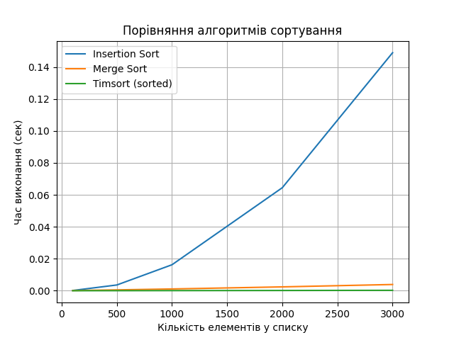

# Порівняльний аналіз алгоритмів сортування в Python

## Мета

Провести емпіричне порівняння трьох алгоритмів сортування:

* Сортування вставками (Insertion Sort)
* Сортування злиттям (Merge Sort)
* Timsort (вбудований алгоритм Python, використовується у `sorted()` та `.sort()`)

## Теоретична складність

| Алгоритм       | Найгірший випадок | Середній випадок | Найкращий випадок |
| -------------- | ----------------- | ---------------- | ----------------- |
| Insertion Sort | O(n^2)            | O(n^2)           | O(n)              |
| Merge Sort     | O(n log n)        | O(n log n)       | O(n log n)        |
| Timsort        | O(n log n)        | O(n log n)       | O(n)              |

## Методика тестування

* Використано модуль `timeit` для заміру часу виконання.
* Дані: випадкові масиви цілих чисел довжиною 100, 500, 1000, 2000 та 3000 елементів.
* Кожен алгоритм тестувався окремо на однакових копіях даних.

## Результати (прикладові спостереження)

* Insertion Sort різко втрачає ефективність при зростанні розміру вхідних даних.
* Merge Sort стабільно працює при великих розмірах, але повільніше, ніж Timsort.
* Timsort показав найкращі результати в усіх тестах завдяки своїй гібридній природі.

## Висновки

* Timsort значно ефективніший на практиці.
* Для більшості задач програмістам немає сенсу реалізовувати сортування вручну.
* Вбудовані функції `sorted()` та `.sort()` у Python є оптимальним вибором для реального використання.

